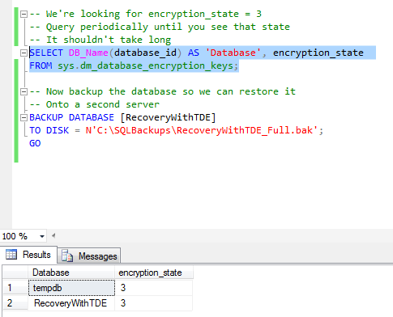

# SQL Server encryption

- Transparent Data Encryption (TDE)
- Column encryption
- Always Encrypted (Database Engine)

### Coding

USE [master];
GO 

-- Create the database master key
-- to encrypt the certificate
CREATE MASTER KEY
  ENCRYPTION BY PASSWORD = 'FirstServerPassw0rd!';
GO 

-- Create the certificate we're going to use for TDE
CREATE CERTIFICATE TDECert
  WITH SUBJECT = 'TDE Cert for Test';
GO 

-- Back up the certificate and its private key
-- Remember the password!
BACKUP CERTIFICATE TDECert
  TO FILE = N'C:\SQLBackups\TDECert.cer'
  WITH PRIVATE KEY ( 
    FILE = N'C:\SQLBackups\TDECert_key.pvk',
 ENCRYPTION BY PASSWORD = 'APrivateKeyP4ssw0rd!'
  );
GO

USE [hrms];
GO 

-- Create the DEK so we can turn on encryption
USE [RecoveryWithTDE];
GO 

CREATE DATABASE ENCRYPTION KEY
  WITH ALGORITHM = AES_256
  ENCRYPTION BY SERVER CERTIFICATE TDECert;
GO 

-- Exit out of the database. If we have an active 
-- connection, encryption won't complete.
USE [master];
GO 

-- Turn on TDE
ALTER DATABASE [hrms]
  SET ENCRYPTION ON;
GO 

---

This starts the encryption process on the database. Note the password specified for the database master key. As is implied, when we go to do the restore on the second server, we will going to use a different password. Having the same password is not required, but having the same certificate is.

Even on databases that are basically empty, it does take a few seconds to encrypt the database. Check the status of the encryption with the following query:

-- We're looking for encryption_state = 3
-- Query periodically until you see that state
-- It shouldn't take long
SELECT DB_Name(database_id) AS 'Database', encryption_state 
FROM sys.dm_database_encryption_keys;

As the comments indicate, we're looking for our database to show a state of 3, meaning the encryption is finished: 

