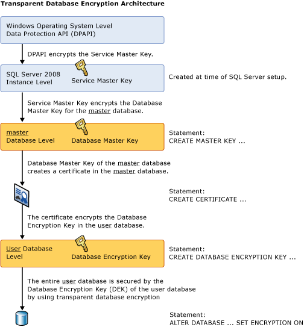
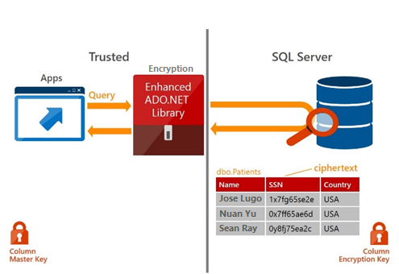

- title : SQL Server encryption
- description : SQL Server encryption option
- author : Alexey Zorchenkov
- theme : night
- transition : default

***

### SQL Server encryption

- Transparent Data Encryption (TDE)
- Column encryption
- Always Encrypted (Database Engine)

***
- id : TDE-1

### Transparent Data Encryption (TDE)

- performs real-time I/O encryption and decryption of the data and log files
- uses a database encryption key (DEK), which is stored in the database boot record for availability during recovery
- DEK is a symmetric key secured by using a certificate stored in the master database of the server or an asymmetric key protected by an EKM module
- TDE protects data "at rest", meaning the data and log files
- provides the ability to comply with many laws, regulations, and guidelines established in various industries
- enables software developers to encrypt data by using AES and 3DES encryption algorithms without changing existing applications.

---
- id : TDE-2

---
- id : TDE-3

### Implementation

- Create a master key
- Create or obtain a certificate protected by the master key
- Create a database encryption key and protect it by the certificate
- Set the database to use encryption

---
- id: TDE-4

### Coding

	USE master;
	GO

	CREATE MASTER KEY ENCRYPTION BY PASSWORD = '<UseStrongPasswordHere>';
	GO

	CREATE CERTIFICATE MyServerCert WITH SUBJECT = 'My DEK Certificate';
	GO

	USE AdventureWorks2012;
	GO

	CREATE DATABASE ENCRYPTION KEY
	WITH ALGORITHM = AES_128
	ENCRYPTION BY SERVER CERTIFICATE MyServerCert;
	GO

	ALTER DATABASE AdventureWorks2012
	SET ENCRYPTION ON;
	GO

***
- id : ALWAYS-1

### Always Encrypted (Database Engine)

- feature designed to protect sensitive data, such as credit card numbers or national identification numbers
- Always Encrypted allows clients to encrypt sensitive data inside client applications and never reveal the encryption keys to the Database Engine (SQL Database or SQL Server)
- provides a separation between those who own the data (and can view it) and those who manage the data (but should have no access)
- enables customers to confidently store sensitive data outside of their direct control
- makes encryption transparent to applications
- enables software developers to encrypt data by using AES and 3DES encryption algorithms without changing existing applications.

---
- id : ALWAYS-2

---
- id : ALWAYS-3

### Coding

	CREATE COLUMN MASTER KEY MyCMK
	WITH (
     
    	KEY_STORE_PROVIDER_NAME = 'MSSQL_CERTIFICATE_STORE', 
     
     	KEY_PATH = 'Current User/Personal/f2260f28d909d21c642a3d8e0b45a830e79a1420'
	);

	CREATE COLUMN ENCRYPTION KEY MyCEK 
	WITH VALUES
	(
	    COLUMN_MASTER_KEY = MyCMK, 
	    ALGORITHM = 'RSA_OAEP', 
	    ENCRYPTED_VALUE = 0x01700000016C006F00630061006C006D0061006300680069006E0065002F006D0079002F003200660061006600640038003100320031003400340034006500620031006100320065003000360039003300340038006100350064003400300032003300380065006600620063006300610031006300284FC4316518CF3328A6D9304F65DD2CE387B79D95D077B4156E9ED8683FC0E09FA848275C685373228762B02DF2522AFF6D661782607B4A2275F2F922A5324B392C9D498E4ECFC61B79F0553EE8FB2E5A8635C4DBC0224D5A7F1B136C182DCDE32A00451F1A7AC6B4492067FD0FAC7D3D6F4AB7FC0E86614455DBB2AB37013E0A5B8B5089B180CA36D8B06CDB15E95A7D06E25AACB645D42C85B0B7EA2962BD3080B9A7CDB805C6279FE7DD6941E7EA4C2139E0D4101D8D7891076E70D433A214E82D9030CF1F40C503103075DEEB3D64537D15D244F503C2750CF940B71967F51095BFA51A85D2F764C78704CAB6F015EA87753355367C5C9F66E465C0C66BADEDFDF76FB7E5C21A0D89A2FCCA8595471F8918B1387E055FA0B816E74201CD5C50129D29C015895CD073925B6EA87CAF4A4FAF018C06A3856F5DFB724F42807543F777D82B809232B465D983E6F19DFB572BEA7B61C50154605452A891190FB5A0C4E464862CF5EFAD5E7D91F7D65AA1A78F688E69A1EB098AB42E95C674E234173CD7E0925541AD5AE7CED9A3D12FDFE6EB8EA4F8AAD2629D4F5A18BA3DDCC9CF7F352A892D4BEBDC4A1303F9C683DACD51A237E34B045EBE579A381E26B40DCFBF49EFFA6F65D17F37C6DBA54AA99A65D5573D4EB5BA038E024910A4D36B79A1D4E3C70349DADFF08FD8B4DEE77FDB57F01CB276ED5E676F1EC973154F86
	);

---
- id : ALWAYS-4

### Coding (continued)

	CREATE TABLE Customers (
	    CustName nvarchar(60) 
	        COLLATE  Latin1_General_BIN2 ENCRYPTED WITH (COLUMN_ENCRYPTION_KEY = MyCEK,
	        ENCRYPTION_TYPE = RANDOMIZED,
	        ALGORITHM = 'AEAD_AES_256_CBC_HMAC_SHA_256'), 
	    SSN varchar(11) 
	        COLLATE  Latin1_General_BIN2 ENCRYPTED WITH (COLUMN_ENCRYPTION_KEY = MyCEK,
	        ENCRYPTION_TYPE = DETERMINISTIC ,
	        ALGORITHM = 'AEAD_AES_256_CBC_HMAC_SHA_256'), 
	    Age int NULL
	);
	
	GO

***
- id : COLUMN-1

### Column-level Encryption (Problem)

- requirement to encrypt the data within a database, but cannot let the DBAs see the data
- could build encryption routines into the application, but would prefer to use SQL Server's built-in encryption
- reporting system and my end users need to be able to query the data without having to remember the specialized decryption functions

---
- id : COLUMN-2

### Encrypting Data

	CREATE TABLE dbo.EncryptedData (
	  EncryptedCol VARBINARY(128)
	);
	CREATE ASYMMETRIC KEY ASymKeyPwd
	WITH ALGORITHM = RSA_2048
	ENCRYPTION BY PASSWORD = 'T5PPassword';
	CREATE SYMMETRIC KEY SymKey
	WITH ALGORITHM = AES_256
	ENCRYPTION BY ASYMMETRIC KEY AsymKeyPwd;

	DELETE FROM dbo.EncryptedData;
	GO 

	OPEN SYMMETRIC KEY SymKey
	DECRYPTION BY ASYMMETRIC KEY AsymKeyPwd WITH PASSWORD = 'T5PPassword';
	INSERT INTO dbo.EncryptedData
	(EncryptedCol)
	VALUES
	(ENCRYPTBYKEY(KEY_GUID('SymKey'), 'Encrypted Data!'));
	GO 
	CLOSE SYMMETRIC KEY SymKey;
	GO 

---
- id : COLUMN-3

### Decrypting data

	OPEN SYMMETRIC KEY DataEncrypt
	DECRYPTION BY PASSWORD = 'T5PPassword';
	SELECT CONVERT(VARCHAR(MAX), DECRYPTBYKEY(EncryptedCol))
	FROM dbo.EncryptedData;

---
- id : COLUMN-4

### Creating View (WITH ENCRYPTION !!!)

	CREATE VIEW dbo.SeeEncryptedData
	WITH ENCRYPTION
	AS
	SELECT CONVERT(VARCHAR(MAX), 
	DECRYPTBYKEYAUTOASYMKEY(ASYMKEY_ID('AsymKeyPwd'), N'T5PPassword', EncryptedCol)) 
	AS 'EncryptedCol'
	FROM dbo.EncryptedData;
	GO
	SELECT EncryptedCol 
	FROM dbo.SeeEncryptedData;

---
- id : COLUMN-5

### DBAs would have access to data

- DBAs grant access to the view. They themselves would be able to query the data through the view.
- Likely it's going to be a DBA who runs the CREATE VIEW code in the database and have the password embedded in the code.
- There are tools publicly available, including scripts, that can beat this encryption. Some of them are free.

